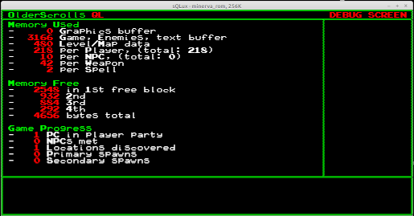
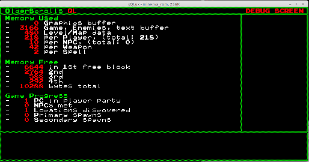

# OlderScrolls Engine - Sinclair QL

This is the Sinclair QL target of the OlderScrolls RPG game engine.

## Sinclair QL Details

The QL was the intended follow up to the massively popular 8bit Zilog Z80-powered Sinclair Spectrum range of computers produced by Sinclair Research in the early 1980's.

### Hardware

Unlike the Spectrum with its Z80, the QL was powered by a much more advanced Motorola 68000, but crippled by an 8bit data bus (using the *68008* variant), lack of dedicated sound hardware and complete lack of graphics hardware - using a simple framebuffer a choice of video modes (512x256 4-colour and 256x256 8-colour, both modes being *fixed* colour) which made it very unpopular for the home computer *gamer* market.

---

# Implementation Specifics

Software

  * Builds using [xtc68](https://github.com/stronnag/xtc68), which is a cross compiler for the QL running on Linux

Hardware

  * Will run on a base model 128KB QL
  * Uses 512x256 4-colour mode
  * *(Optionally)* Can use memory expansion to speed up video output (composites screen elements into an off-screen buffer if >128KB memory is detected)
  * Disk interface (or modern SD drive) is *strongly reccomended*

It is reccomended, for acceptable performance, that a floppy drive (physical or Gotek), hard drive or flash memory card is used for running the game engine. The latency of waiting for data to load from Microdrive is likely to be unacceptable.

The QL target has limited support for display of graphics in the game data. Support is restricted to 2bpp Bitmaps which will be rendered in a fixed palette of black, white, red and green. 

---

# Compiling

Prequisities for building:

  * [xtc68](https://github.com/stronnag/xtc68) C68 cross-compiler
  * [qltools](https://github.com/SinclairQL/qltools) QL floppy disk/image utility
  * GNU Make

Change to the *ql* directory and run **make full**. This will do the following:

  * Compile the OlderScrolls engine for QL from source
  * Create a new empty QL format floppy disk image
  * Inject the executeable OlderScrolls binary in the QL floppy
  * Inject any datafiles into the QL floppy
  * *(Optionally)* Start the **sqlux** Sinclair QL emulator with the QL floppy

---

# Status

*Within the sQlux emulator*, loading the "Trouble in Leafy Glade" sample dataset, showing splash screen, automatic text wrapping/re-flow and movement options for a specific location:

### Sample screenshots

Splash screen:

 

Movement options for a location:

### Difference in using libm

One of things I've tried to do with this target, since the QL *always* has 32kb of the base 128kb taken up by the screen (*regardless of video mode*), is reduce the memory use and code wherever possible. In reality, a base mode QL with 128kb doesn't have a whole lot more useable memory than some 64kb 8bit computers.

In my bitmap routines, **bmp_ql.c**, which I reused from earlier work writing [X68kLauncher](https://github.com/megatron-uk/x68klauncher), [PC98Launcher](https://github.com/megatron-uk/pc98launcher) and [X86Launcher](https://github.com/megatron-uk/x86Launcher), I used the *ceil()* function to calculate padded vs unpadded bitmap row lengths (BMP images are always stored in rows padded up to the nearest number pixels divisible by 4). This needed *libm* linking in, and wasn't really a problem on the X68000, PC-98 or IBM/PC with their relatively large (hundreds of kb, or multiple megabytes is *huge* when your code only needs 100kb or so).

However, when you only have tens of kb available to work with, every kb saved is useful.

With libm linked in, and the bmp_ql.c library using ceil(), my debug screen (which attempts multiple *malloc()* calls to find the four largest available memory regions) we find the above status  when beginning the game. In summary, with ceil() and libm:

   * Free memory at runtime: **4656** bytes
   * Size of binary on disk: **43044** bytes

Changing the calls from *ceil()* to several, more long-winded quotient/remainder divisions shows us that at runtime we have increased significantly. We also have a executable that now takes up on-disk space:

   * Free memory at runtime: **10288** bytes
   * Size of binary on disk: **34926** bytes

That gives us the following savings:

   * Runtime saving of **5632** bytes
   * On disk storage saving of **8118** bytes

### To Do

  * User Interface Functions
    * Display player character name(s) and stats in sidebar
    * Show turn number in titlebar
    * Show images in main window based on game events
    * Show player party summary in sidebar
    * Popup party dialogue with weapon/item/armour/magic interface, combat stance etc
    * Display 1bpp bitmaps in user interface at story events/combat etc.

  * Game Data Functions

    * Load and parse player character(s)
    * Load and parse monsters
    * Load and parse weapons and items 

 * Game Logic
    * Combat engine 
    * Talk to NPCs
    * Shop engine
    * Spawning of items
    * Spawning of monsters
    * Save game
    * Create player character (probably as a seperate utility?)

  * User Input Functions 
    * ?

### Completed

  * User Input Functions
    * Accept and parse keyboard input
    * Accept only valid keystrokes for the module we are in (e.g. the 'move' keys shouldn't work during combat)
    * Show movement keyboard option if exits are available
    * Popup movement dialogue box
    * Popup quit game dialogue box

  * User Interface Functions
    * Show splash screen on startup
    * Draw the title bar, main text window, sidebar and bottom status bar
    * Show location name in title bar
    * Display main window story text, including word wrapping and embedded newlines.
    * Display a debug screen with current game status, free/used memory and progress information. *(Currently accessed using the '/' key)*

  * Low Level Drawing Functions
    * Initialise screen to 512x256
    * Render to offscreen buffer (if sufficient additional memory >128kb detected) or direct to video memory
    * Load a 1bpp ASCII font bitmap to memory
    * Blank offscreen buffer/video memory
    * Draw lines, filled/unfilled boxes in red, green, white, black and yellow
    * Flip offscreen buffer to video memory
    * Print fixed length ASCII strings using custom 1bpp font
    * Print word-wrapped, left-justified ASCII strings using custom 1bpp font
    * Simple tags embedded in story text to alter output (only red, green, white colour tags supported in QL target due to restrictions of running in 4 colour mode)

  * Bitmap Functions
    * Read BMP header from disk
    * Read BMP datastructure from disk
    * Read and parse BMP datastructure into a font table
    * Change use of **ceil()** in **bmp_ql.c** to a series of quotient/remainder calculations. *(Removes the need to link in libm and saves nearly 6kbytes of memory!)*

  * Game Data Functions
    * Load initial game data from map file
    * Load new game data when moving to new location 
    * Parse simple tags in story text (highlight colour)